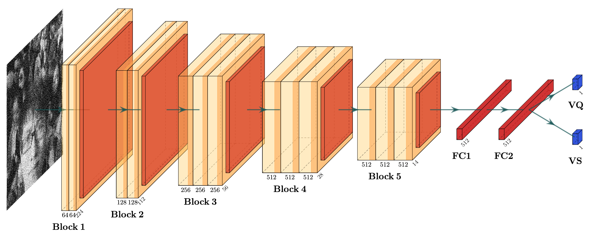

# Visual Quality and Security Assessment of Perceptually Encrypted Images based on Multi-output Deep Neural Network (VSMML)
In this work, we propose a blind CNN-based visual security metric for perceptually encrypted images called VSMML metric. Given an encrypted image, our metric predicts two scores simultaneously, which correspond to the visual security (VS) and visual quality (VQ) scores, as illustrated in Figure below.<br>



# Experiments

<!-- 
|   Tasks  | lfz |      ROCC      |      KROCC     |      PLCC      |
|:--------:|:---:|:--------------:|:--------------:|:--------------:|
| VQ<br>VS |  0  | 0.897<br>0.930 | 0.744<br>0.777 | 0.873<br>0.930 |
| VQ<br>VS |  2  | 0.929<br>0.960 | 0.790<br>0.833 | 0.908<br>0.959 |
| VQ<br>VS |  4  | 0.929<br>0.955 | 0.785<br>0.817 | 0.883<br>0.951 |


|    Tasks   	|  Weighting 	|      SROCC     	|      KROCC     	|      PLCC      |
|:----------:	|:----------:	|:--------------:	|:--------------:	|:--------------:|
| ωVQ<br>ωVS 	| 0.9<br>0.1 	| 0.926<br>0.950 	| 0.782<br>0.814 	| 0.883<br>0.946 |
| ωVQ<br>ωVS 	| 0.8<br>0.2 	| 0.938<br>0.955 	| 0.803<br>0.823 	| 0.901<br>0.955 |
| ωVQ<br>ωVS 	| 0.7<br>0.3 	| 0.920<br>0.944 	| 0.773<br>0.802 	| 0.877<br>0.940 |
| ωVQ<br>ωVS 	| 0.6<br>0.4 	| 0.937<br>0.962 	| 0.800<br>0.835 	| 0.898<br>0.958 |
| ωVQ<br>ωVS 	| 0.5<br>0.5 	| 0.940<br>0.962 	| 0.805<br>0.840 	| 0.897<br>0.956 |
| ωVQ<br>ωVS 	| 0.4<br>0.6 	| 0.934<br>0.961 	| 0.806<br>0.844 	| 0.915<br>0.962 |
| ωVQ<br>ωVS 	| 0.3<br>0.7 	| 0.901<br>0.932 	| 0.758<br>0.789 	| 0.907<br>0.941 |
| ωVQ<br>ωVS 	| 0.2<br>0.8 	| 0.876<br>0.931 	| 0.715<br>0.777 	| 0.854<br>0.927 |
| ωVQ<br>ωVS 	| 0.1<br>0.9 	| 0.843<br>0.925 	| 0.672<br>0.766 	| 0.831<br>0.924 |
-->
All experiments are carried out on Google Colab on Mac OS and the detailed results are given in the paper.<br>
Two publicly perceptually encrypted image databases are used in our experiments: 
* IVC-SelectEncrypt; 
* Perceptually Encrypted Image Database (PEID);<br>


This table shows the performance comparison on IVC-SelectEncrypt and PEID datasets with visual quality (VQ) and visual security (VS) scores. 
<table class="tg" style="margin: auto">
<thead>
  <tr>
    <th class="tg-7btt" rowspan="2"><br>Metrics</th>
    <th class="tg-7btt" colspan="3">IVC-SelectEncrypt</th>
    <th class="tg-7btt" colspan="3">PEID (VQ)</th>
    <th class="tg-7btt" colspan="3">PEID (VS)</th>
  </tr>
  <tr>
    <th class="tg-7btt">SROCC</th>
    <th class="tg-7btt">KROCC</th>
    <th class="tg-7btt">PLCC</th>
    <th class="tg-7btt">SROCC</th>
    <th class="tg-7btt">KROCC</th>
    <th class="tg-7btt">PLCC</th>
    <th class="tg-7btt">SROCC</th>
    <th class="tg-7btt">KROCC</th>
    <th class="tg-7btt">PLCC</th>
  </tr>
</thead>
<tbody>
  <tr>
    <td class="tg-7btt">MSE</td>
    <td class="tg-c3ow">0.916</td>
    <td class="tg-c3ow">0.775</td>
    <td class="tg-c3ow">0.683</td>
    <td class="tg-c3ow">0.811</td>
    <td class="tg-c3ow">0.748</td>
    <td class="tg-c3ow">0.890</td>
    <td class="tg-c3ow">0.800</td>
    <td class="tg-c3ow">0.603</td>
    <td class="tg-c3ow">0.810</td>
  </tr>
  <tr>
    <td class="tg-7btt">PSNR</td>
    <td class="tg-c3ow">0.916</td>
    <td class="tg-c3ow">0.775</td>
    <td class="tg-c3ow">0.910</td>
    <td class="tg-c3ow">0.813</td>
    <td class="tg-c3ow">0.646</td>
    <td class="tg-c3ow"> 0.869</td>
    <td class="tg-c3ow">0.797</td>
    <td class="tg-c3ow">0.613</td>
    <td class="tg-c3ow">0.835</td>
  </tr>
  <tr>
    <td class="tg-7btt">SSIM</td>
    <td class="tg-c3ow">0.851</td>
    <td class="tg-c3ow">0.689</td>
    <td class="tg-c3ow">0.718</td>
    <td class="tg-c3ow">0.825</td>
    <td class="tg-c3ow">0.670</td>
    <td class="tg-c3ow">0.843</td>
    <td class="tg-c3ow">0.850</td>
    <td class="tg-c3ow">0.677</td>
    <td class="tg-c3ow">0.829</td>
  </tr>
  <tr>
    <td class="tg-7btt">FSIM</td>
    <td class="tg-c3ow">0.975</td>
    <td class="tg-c3ow">0.876</td>
    <td class="tg-c3ow">0.896</td>
    <td class="tg-c3ow">0.890</td>
    <td class="tg-c3ow">0.752</td>
    <td class="tg-c3ow">0.911</td>
    <td class="tg-c3ow">0.858</td>
    <td class="tg-c3ow">0.685</td>
    <td class="tg-c3ow">0.880</td>
  </tr>
  <tr>
    <td class="tg-7btt">GMSD</td>
    <td class="tg-c3ow">0.968</td>
    <td class="tg-c3ow">0.849</td>
    <td class="tg-c3ow">0.955</td>
    <td class="tg-c3ow">0.801</td>
    <td class="tg-c3ow">0.646</td>
    <td class="tg-c3ow">0.898</td>
    <td class="tg-c3ow">0.754</td>
    <td class="tg-c3ow">0.578</td>
    <td class="tg-c3ow">0.858</td>
  </tr>
  <tr>
    <td class="tg-7btt">MAD</td>
    <td class="tg-c3ow">0.963</td>
    <td class="tg-c3ow">0.836</td>
    <td class="tg-c3ow">0.952</td>
    <td class="tg-c3ow">0.890</td>
    <td class="tg-c3ow">0.748</td>
    <td class="tg-c3ow">0.905</td>
    <td class="tg-c3ow">0.885</td>
    <td class="tg-c3ow">0.733</td>
    <td class="tg-c3ow">0.898</td>
  </tr>
  <tr>
    <td class="tg-7btt">VIF</td>
    <td class="tg-c3ow">0.959</td>
    <td class="tg-c3ow">0.832</td>
    <td class="tg-c3ow">0.955</td>
    <td class="tg-c3ow">0.924</td>
    <td class="tg-c3ow">0.797</td>
    <td class="tg-7btt">0.968</td>
    <td class="tg-c3ow">0.926</td>
    <td class="tg-c3ow">0.787</td>
    <td class="tg-c3ow">0.945</td>
  </tr>
  <tr>
    <td class="tg-7btt">NIQE</td>
    <td class="tg-c3ow">0.731</td>
    <td class="tg-c3ow">0.547</td>
    <td class="tg-c3ow">0.496</td>
    <td class="tg-c3ow">0.459</td>
    <td class="tg-c3ow">0.335</td>
    <td class="tg-c3ow">0.327</td>
    <td class="tg-c3ow">0.524</td>
    <td class="tg-c3ow">0.383</td>
    <td class="tg-c3ow">0.528</td>
  </tr>
  <tr>
    <td class="tg-7btt">BRISQUE</td>
    <td class="tg-c3ow">0.663</td>
    <td class="tg-c3ow">0.485</td>
    <td class="tg-c3ow">0.685</td>
    <td class="tg-c3ow">0.352</td>
    <td class="tg-c3ow">0.251</td>
    <td class="tg-c3ow">0.339</td>
    <td class="tg-c3ow">0.436</td>
    <td class="tg-c3ow">0.305</td>
    <td class="tg-c3ow">0.459</td>
  </tr>
  <tr>
    <td class="tg-7btt">ESS*</td>
    <td class="tg-c3ow">0.957</td>
    <td class="tg-c3ow">0.839</td>
    <td class="tg-c3ow">0.948</td>
    <td class="tg-c3ow">0.816</td>
    <td class="tg-c3ow">0.671</td>
    <td class="tg-c3ow">0.922</td>
    <td class="tg-c3ow">0.771</td>
    <td class="tg-c3ow">0.599</td>
    <td class="tg-c3ow">0.891</td>
  </tr>
  <tr>
    <td class="tg-7btt">LSS*</td>
    <td class="tg-c3ow">0.953</td>
    <td class="tg-c3ow">0.823</td>
    <td class="tg-c3ow">0.943</td>
    <td class="tg-c3ow">0.798</td>
    <td class="tg-c3ow">0.628</td>
    <td class="tg-c3ow">0.767</td>
    <td class="tg-c3ow">0.770</td>
    <td class="tg-c3ow">0.591</td>
    <td class="tg-c3ow">0.751</td>
  </tr>
  <tr>
    <td class="tg-7btt">LEG*</td>
    <td class="tg-c3ow">0.887</td>
    <td class="tg-c3ow">0.723</td>
    <td class="tg-c3ow">0.898</td>
    <td class="tg-c3ow">0.845</td>
    <td class="tg-c3ow">0.681</td>
    <td class="tg-c3ow">0.900</td>
    <td class="tg-c3ow">0.848</td>
    <td class="tg-c3ow">0.666</td>
    <td class="tg-c3ow">0.882</td>
  </tr>
  <tr>
    <td class="tg-7btt">LFBVS*</td>
    <td class="tg-c3ow">0.895</td>
    <td class="tg-c3ow">0.726</td>
    <td class="tg-c3ow">0.872</td>
    <td class="tg-c3ow">0.634</td>
    <td class="tg-c3ow">0.486</td>
    <td class="tg-c3ow">0.751</td>
    <td class="tg-c3ow">0.630</td>
    <td class="tg-c3ow">0.466</td>
    <td class="tg-c3ow">0.730</td>
  </tr>
  <tr>
    <td class="tg-7btt">NICE*</td>
    <td class="tg-c3ow">0.908</td>
    <td class="tg-c3ow">0.759</td>
    <td class="tg-c3ow">0.631</td>
    <td class="tg-c3ow">0.824</td>
    <td class="tg-c3ow">0.486</td>
    <td class="tg-c3ow">0.651</td>
    <td class="tg-c3ow">0.593</td>
    <td class="tg-c3ow">0.437</td>
    <td class="tg-c3ow">0.617</td>
  </tr>
  <tr>
    <td class="tg-7btt">LE*</td>
    <td class="tg-c3ow">0.093</td>
    <td class="tg-c3ow">0.072</td>
    <td class="tg-c3ow">0.263</td>
    <td class="tg-c3ow">0.092</td>
    <td class="tg-c3ow">0.079</td>
    <td class="tg-c3ow">0.01</td>
    <td class="tg-c3ow">0.155</td>
    <td class="tg-c3ow">0.113</td>
    <td class="tg-c3ow">0.181</td>
  </tr>
  <tr>
    <td class="tg-7btt">NSD*</td>
    <td class="tg-c3ow">0.715</td>
    <td class="tg-c3ow">0.529</td>
    <td class="tg-c3ow">0.592</td>
    <td class="tg-c3ow">0.278</td>
    <td class="tg-c3ow">0.196</td>
    <td class="tg-c3ow">0.385</td>
    <td class="tg-c3ow">0.31</td>
    <td class="tg-c3ow">0.214</td>
    <td class="tg-c3ow">0.371</td>
  </tr>
  <tr>
    <td class="tg-7btt">VSI-Canny*</td>
    <td class="tg-c3ow">0.949</td>
    <td class="tg-c3ow">0.819</td>
    <td class="tg-c3ow">0.95</td>
    <td class="tg-c3ow">0.83</td>
    <td class="tg-c3ow">0.708</td>
    <td class="tg-c3ow">0.941</td>
    <td class="tg-c3ow">0.805</td>
    <td class="tg-c3ow">0.635</td>
    <td class="tg-c3ow">0.882</td>
  </tr>
  <tr>
    <td class="tg-7btt">QETE*</td>
    <td class="tg-c3ow">0.894</td>
    <td class="tg-c3ow">0.692</td>
    <td class="tg-c3ow">0.726</td>
    <td class="tg-c3ow">0.825</td>
    <td class="tg-c3ow">0.691</td>
    <td class="tg-c3ow">0.853</td>
    <td class="tg-c3ow">0.813</td>
    <td class="tg-c3ow">0.676</td>
    <td class="tg-c3ow">0.818</td>
  </tr>
  <tr>
    <td class="tg-7btt">IIBVSI*</td>
    <td class="tg-c3ow">0.968</td>
    <td class="tg-c3ow">0.848</td>
    <td class="tg-c3ow">0.966</td>
    <td class="tg-c3ow">0.642</td>
    <td class="tg-c3ow">0.451</td>
    <td class="tg-c3ow">0.753</td>
    <td class="tg-c3ow">0.878</td>
    <td class="tg-c3ow">0.719</td>
    <td class="tg-c3ow">0.893</td>
  </tr>
  <tr>
    <td class="tg-7btt">TL-VGG16*</td>
    <td class="tg-c3ow">0.943</td>
    <td class="tg-c3ow">0.798</td>
    <td class="tg-c3ow">0.969</td>
    <td class="tg-c3ow">0.892</td>
    <td class="tg-c3ow">0.743</td>
    <td class="tg-c3ow">0.935</td>
    <td class="tg-c3ow">0.935</td>
    <td class="tg-c3ow">0.788</td>
    <td class="tg-c3ow">0.933</td>
  </tr>
  <tr>
    <td class="tg-7btt">VSMML (Our)*</td>
    <td class="tg-7btt">0.9828</td>
    <td class="tg-7btt">0.9018</td>
    <td class="tg-7btt">0.9794</td>
    <td class="tg-7btt">0.9347</td>
    <td class="tg-7btt">0.8065</td>
    <td class="tg-c3ow">0.915</td>
    <td class="tg-7btt">0.9617</td>
    <td class="tg-7btt">0.8445</td>
    <td class="tg-7btt">0.9627</td>
  </tr>
</tbody>
</table>

# Usage

* Training:<br>
  To train the model on another database, refer to the file `TRAIN_ON_PEID.ipynb` or `TRAIN_ON_IVC.ipynb` 
* Evaluation:<br>
  To evaluate the performance of our model, please refer to the file `Test_ON_PEID.ipynb` or `Test_ON_IVC.ipynb`
  
# Pretrained models
We have trained our models on 80% of datasets and you can find them in `./models`

# Citation
```
@inproceedings{fezza2021visual,
  title={Visual Quality and Security Assessment of Perceptually Encrypted Images Based on Multi-Output Deep Neural Network},
  author={Fezza, Sid Ahmed and Keita, Mamadou and Hamidouche, Wassim},
  booktitle={2021 9th European Workshop on Visual Information Processing (EUVIP)},
  pages={1--6},
  year={2021},
  organization={IEEE}
}
```


